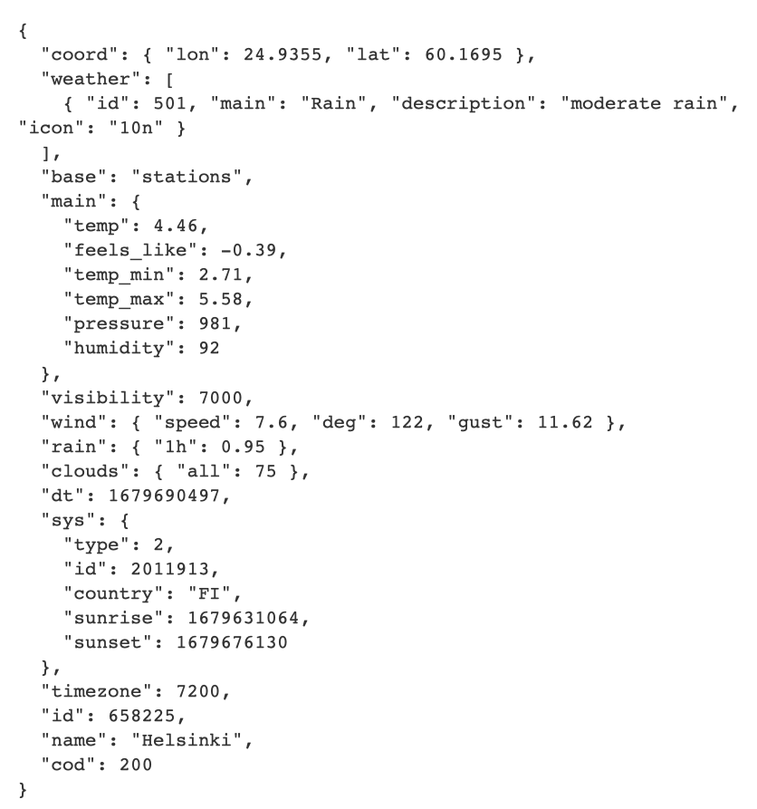
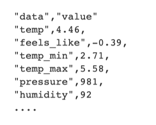

# Aufgaben OpenWeather

# Intro
In dieser Praxis-Übung werden Sie Wetterdaten von einer API herunterladen und speichern. Als Ausgangslage erhalten Sie ein Script, welches eine grundsätzlich Funktionalität bereit stellt, um Wetterdaten herunterzuladen. Das Skript sollen Sie dann in mehreren Schritten verbessern und ausbauen.
 
 
**Tipp**: Nehmen Sie die Jupyter-Notebooks als Hilfestellung zur Hand, falls Sie bei einem Thema nicht weiterkommen.  
**Tipp**: Falls Sie bei einer Aufgabe Probleme haben, versuchen Sie stattdessen eine andere Aufgabe zu lösen.
 
 
 

1. Aufgabe: TXT speichern
Speichern Sie das Wetter für jede Stadt als Textdatei in einem Ordner mit dem Namen “OpenWeather_txt“ ab. Der Dateinamen sollte den aktuellen Zeitstempel enthalten und folgendes Format vorweisen:  
 
weather_[Stadt]_[Zeitstempel].txt
  
Vorzugsweise erstellen Sie dazu eine Funktion, welche im For-Loop aufgerufen werden kann.  

2. Aufgabe:CSV auslesen 
Die TargetCities sollen nicht hartkodiert im Code hinterlegt werden. Erstellen Sie eine leere CSV-Datei und speichern Sie die Städte in dieser Datei. Anschliessend erstellen Sie eine Funktion, in welcher Sie die Städte aus der CSV-Datei auslesen und in die Liste cityList speichern.

3. Aufgabe: JSON speichern 
Die Response vom API-Aufruf gibt die Daten im Format Json zurück:   
   
Schreiben Sie eine Funktion, welche die Response in ein korrektes JSON-Format umwandelt und speichern sie im For-Loop jede Datei als JSON-Datei im Ordner “OpenWeather_json“.  
 
Dateinamen: weather_[Stadt]_[Zeitstempel].json 
 

4. Aufgabe: CSV speichern 
Damit die Daten in einem BI-Tool analysiert werden können, möchten Sie sie als flache Datei im CSV-Format speichern. Erstellen Sie den Ordner “OpenWeather_csv“. 
 
Dateinamen: weather_[Stadt]_[Zeitstempel].csv Vorzugsweise erstellen Sie dazu eine Funktion, welche im For-Loop aufgerufen werden kann. 
 
Entscheiden Sie selbst, wie weit Sie die JSON-Struktur glätten. Die CSV sollte auf jeden Fall die folgenden Werte (hier als Beispiel) gespeichert haben: 
 
 

5. Aufgabe: Parquet speichern  
Speichern Sie die Responses im Parquet-Format ab. Verwenden Sie dazu die Pandas Library. https://pandas.pydata.org/pandas-docs/version/1.1 /reference/api/pandas.DataFrame.to_parquet.html Erstellen Sie den Ordner “OpenWeather_parquet“. 
 
Dateinamen: weather_[Stadt]_[Zeitstempel].parquet Vorzugsweise erstellen Sie dazu eine Funktion, welche im For-Loop aufgerufen werden kann. 
 

6. Aufgabe: Partitionierung 
 
Die Daten sollen nicht nur in einem einzelnen Ordner gespeichert werden, sondern in verschiedene Partitionen unterteilt werden. 
 
Erweitern Sie den For-Loop so, dass zusätzlich zum Dateinamen ein dynamischer Ordner-Pfad erstellt wird, welche folgende Partitionen enthält: /Rootpath/Filetype=[Fileformat]/Year=[Year]/Month=[Month]/City=[City]/Filename Beispiel: C:/meinSpeicherOrt/Filetype=JSON/Year=2023/Month=03/City=Zuerich/20230301T020009Z.json 
 

7. Aufgabe: Willkommensnachricht 
Ändern Sie das Skript so ab, dass als erster Schritt eine Ausgabe auf dem Terminal ausgegeben wird mit einer Willkommens-Nachricht.  
 

8. Aufgabe: Benutzereingabe 1 
Ändern Sie das Skript so ab, dass nach der Willkommensnachricht eine Benutzereingabe gemacht werden muss. Dabei kann der Benutzer zuerst wählen, ob die Städte der vorgegebenen Liste heruntergeladen soll. Wenn ja, sollen die Daten heruntergeladen werden werden. Bei Nein, soll das Programm mit einer Abschieds-Botschaft beendet werden. 
 

9. Aufgabe: Benutzereingabe 2 
Erweitern Sie die Benutzereingabe hinfolglich, dass bei einem nein, dass die Städte nicht heruntergeladen werden sollen, eine Stadt eingetippt werden kann. Anschliessend soll nur von dieser Stadt die Daten heruntergeladen werden. 
 

10. Aufgabe: Benutzereingabe überprüfen 
 
Überprüfen Sie die Benutzereingabe, ob es sich beim Text um eine echte Stadt handelt. 
 
Wie würden Sie das realisieren? 
 
Wie gehen Sie mit Falscheingaben um? 
 

11. Aufgabe: Archivierung 
Ändern Sie die Benutzereingabe folgendermassen, dass der Benutzer folgende Optionen erhält: 
0: Programm beenden 
1: Vorgegebene Städteliste herunterladen 
2: Stadt eintippen und herunterladen 
3: Bereits heruntergeladene Städte archivieren 
 
Bei Option 3: 
- Falls sich keine Daten im Download-Verzeichnis befinden, beenden Sie das Programm
- Ansonsten führen Sie eine Funktion aus, welche durch das Download-Verzeichnis traversiert und jede Datei in ein ZIP-Archiv entpackt. Das ZIPArchiv soll denn in den Ordner “OpenWeather_Archiv“ mit derselben Partitionierung gespeichert werden. Die ursprüngliche Datei soll gelöscht werden.